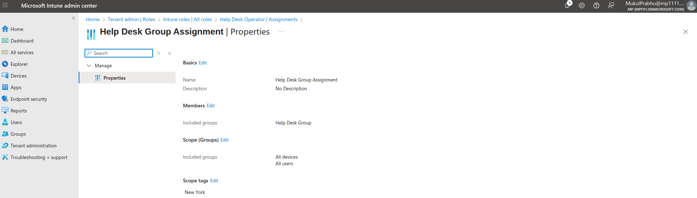

# LAB 2: Add the Help Desk group to the Help Desk Intune Role

The goal of this lab is to implement **least-privilege RBAC** in Intune by assigning a dedicated Help Desk security group to the built-in **Help Desk Operator** role, scoped only to the devices/users they should manage (via **Scope (Groups)** and optional **scope tags**). This ensures help desk staff can perform the operational tasks they need—like **sync, restart, remote lock, and reset passcode**—while preventing access to high-risk configuration areas reserved for full Intune/Global admins. In short, we’re formalizing support access so it’s **safe, auditable, and limited to the right resources**.

## **Step 1 – Create a Help Desk Security Group**

- Go to **Entra ID → Groups → New group**.
- **Type**: Security (role assignments target **users**, not devices).
- **Membership**: Assigned (or **Dynamic user** if you want auto-membership by attribute).
- Add members → your help desk users (e.g., `HelpDesk-Operators`).
- This group will be used as the **admin group** in the role assignment.

---

## **Step 2 – (Optional) Create a Scope Tag**

- Navigate: **Intune admin center → Tenant administration → Scope tags → Create**.
- Name: e.g., `NY-Branch` (or your site/business unit).
- Apply the scope tag to **devices/apps/policies** your help desk should see.
- Limits visibility so help desk only manages **tagged resources** (least privilege).

---

## **Step 3 – Assign Built-in Help Desk Operator Role**

- Navigate: **Intune admin center → Tenant administration → Roles → All roles**.
- Open **Help Desk Operator** → **Assignments** → **Add assignment**.
- **Basics**: Name it (e.g., `HelpDesk-Operators_Assignment`).
- **Scope (Groups)**: Choose **All devices/users** *or* **Selected groups** (e.g., `NY-Devices`, `NY-Users`).
- **Admin groups**: Select your **Help Desk** security group from Step 1.
- **Scope tags**: Select tags (e.g., `NY-Branch`) if used.
- **Create** to finalize the role assignment.

---

## **Step 4 – Validate Access**

- Sign in as a **Help Desk** user → **Devices** in Intune.
- Confirm actions like **Sync**, **Restart**, **Remote lock**, **Reset passcode** are available.
- Verify visibility is restricted per **Scope (Groups)** and **Scope tags**.

